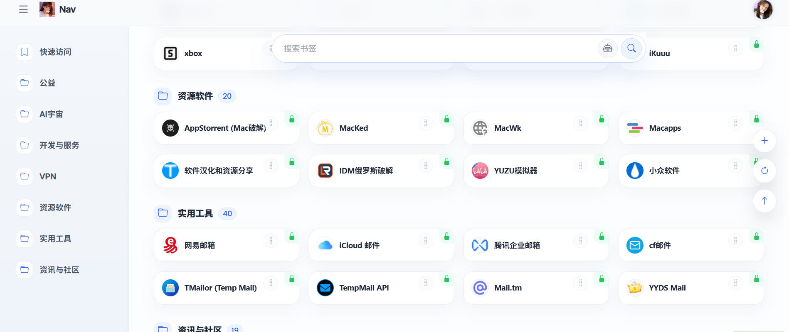
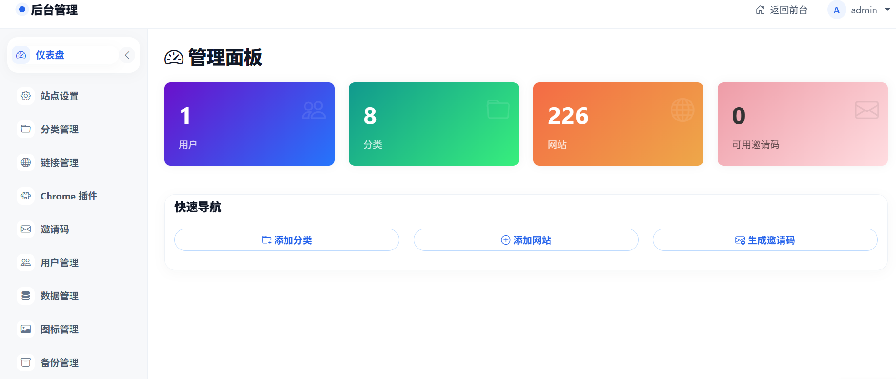
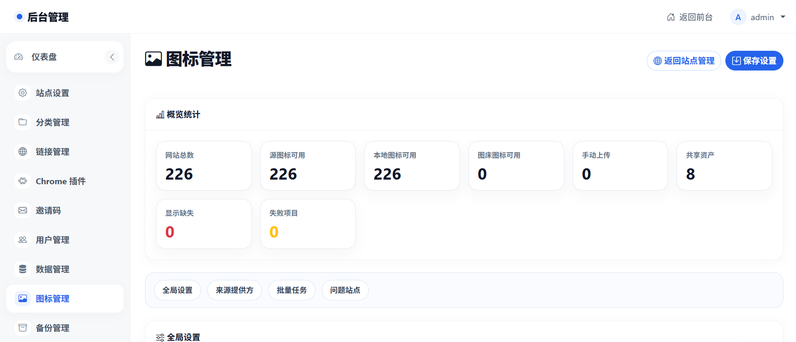

> [!IMPORTANT]
> **本仓库已停止功能维护。**
>
> BookNav 已迁移至全新架构（Go + Vue 3），后续开发与问题反馈请前往：
>
> **https://github.com/DEKVIW/book-nav-next**
>
> 本仓库（Flask 版）仅保留为历史参考与存档，不再合并新功能或常规修复。

---

# BookNav - 高度可定制的个人导航网站

BookNav 是一个使用 Flask 构建的、可通过 Docker 轻松部署的个人导航网站项目。它旨在帮助用户整理和快速访问常用的网站链接，提供分类管理和丰富的交互功能，并支持邀请码注册系统来控制用户访问。







## ✨ 特色功能

BookNav 基于 Flask Web 框架打造，提供了以下核心功能：

### 🧰 交互增强功能

- **🖱️ 右键菜单交互**: 链接卡片右键可弹出快捷菜单，支持添加、编辑、删除、复制链接等操作
- **⚡ 快速添加网站**: 首页直接粘贴链接可弹出快速添加链接对话框，无需进入后台
- **🤏 拖拽排序功能**:
  - 支持网站卡片拖拽排序
  - 支持侧边栏分类拖拽排序
- **🔄 重复链接验证功能**:
  - 在添加或编辑网站时自动检测 URL 是否已存在
  - 智能提示已存在的链接及其所属分类
  - 提供选项: 取消添加、强制添加或跳转到已有链接
  - 有效防止重复添加相同网站，保持导航整洁

### 🔍 高效搜索系统

- **全局快速搜索**: 顶部搜索框支持即时搜索整站内容
- **多维度匹配**:支持网站标题、URL、描述和关键词的全文搜索
- **分类内搜索**: 在特定分类页面可限定搜索范围
- **🤖 AI 智能搜索**: 基于向量语义搜索，支持自然语言查询，渐进式结果展示，后台可批量生成向量索引

### **📤 数据库导入导出功能**:

- 完美兼容 OneNav 数据结构，支持无缝迁移
- 支持导入 OneNav 的 SQLite 数据库导出文件
- 自动匹配分类，保留原有的组织结构
- 导出为多种格式：原生格式、OneNav 兼容格式

### ⚙️ 后台管理系统

- **完整的后台管理界面**: 独立的管理控制台
- **网站与分类管理**: 完整的增删改查功能，批量删除，批量修改公开，私有状态
- **站点设置**: 自定义站点名称、Logo、SEO 信息等，支持自定义背景图片，支持开启链接跳转过渡页（支持放广告）
- **AI 配置优化**:
  - 优化 AI 配置页面布局，改进错误提示的精确性和可读性
  - 分离向量 API 配置测试，独立显示 Embedding API 和 Qdrant 连接状态
  - 新增 AI 自动翻译功能，支持一键翻译网站描述为中文
- **邀请码管理**: 生成和管理注册邀请码
- **数据批量操作功能**：
  - 一键抓取图标
  - 一键清空所有数据
  - 备份功能
- **☁️ WebDAV 云端备份**：
  - 支持配置多个 WebDAV 云端（坚果云、Alist、NextCloud 等）
  - 每个云端独立设置自动备份间隔和保留份数
  - 支持手动备份、远端文件管理（查看、下载、删除）
  - 备份文件自动压缩为 .zip，密码加密存储

### 🔐 用户系统

- **用户管理**: 首次启动默认超级管理员权限，支持查看和管理用户账户，支持添加普通用户和管理员角色

* **邀请码注册**: 仅通过邀请码才能注册新用户，确保站点的私密性
* **用户认证**: 完整的登录、注册和登出功能
* **权限管理**: 区分普通用户和管理员权限

注意：如果多用户，谨慎放开用户的的超级管理员权限；可以适当放开普通管理员权限（普通管理员后台功能只涉及链接相关和邀请码部分）

### 🖼️ 图标处理

- **自动获取网站图标**: 自动尝试获取并显示网站的 Favicon
- **图标本地化缓存**: 支持批量同步到本地、去重复用、失败重试，降低对外部图标源的依赖
- **来源策略可配置**: 支持原站解析与多种代理源，后台可启用、禁用、排序和自定义来源提供方
- **后台图标管理**: 提供全局规则、批量任务、任务记录、问题站点处理与图床同步配置
- **防盗链支持**: 使用 `referrerpolicy="no-referrer"` 解决跨域图片加载问题
- **优雅的降级显示**: 当图标加载失败时，显示基于网站名称首字母的默认图标
- **一致的视觉体验**: 确保界面整洁一致，即使外部资源不可用

### 📱 响应式设计

- **全设备适配**: 完美支持桌面、平板和移动设备
- **布局自适应**: 基于 Bootstrap 的响应式网格系统
- **触摸友好**: 为移动设备优化的交互体验

## 🛠️ 技术栈

### 后端

- **核心框架**: Python 3.9+, Flask
- **ORM**: SQLAlchemy
- **数据库迁移**: Flask-Migrate
- **用户认证**: Flask-Login
- **表单处理**: Flask-WTF
- **WSGI 服务器**: Gunicorn

### 前端

- **UI 框架**: Bootstrap 5
- **动画效果**: Animate.css
- **图标**: Font Awesome, Bootstrap Icons
- **交互**: 原生 JavaScript

### 数据存储

- **默认数据库**: SQLite
- **可选扩展**: 支持 PostgreSQL, MySQL 等关系型数据库
- **向量数据库**: Qdrant（AI 搜索）

### 部署

- **容器化**: Docker, Docker Compose
- **Web 服务器**: Nginx (容器内反向代理)
- **进程管理**: Supervisor

## 🚀 部署指南

### Docker Compose 部署 (推荐)

#### 自构建镜像运行

1.  **环境准备**:

    - 安装 [Docker](https://docs.docker.com/get-docker/)
    - 安装 [Docker Compose](https://docs.docker.com/compose/install/)

2.  **获取代码**:

    ```bash
    git clone https://github.com/yourusername/booknav.git
    cd booknav
    sed -i 's/\r$//' docker/cleanup_backups.sh
    sed -i 's/\r$//' docker/entrypoint.sh
    ```

3.  **构建与启动**:

    ```bash
    docker-compose build
    docker-compose up -d
    ```

4.  **访问**:

    - 在浏览器中打开 `http://<您的服务器IP>:8988`
    - 默认用户名：`admin`，密码：`admin123`

#### 拉取镜像运行

**开发环境**（使用 `docker-compose.yml`）:

```bash
docker-compose up -d
```

**生产环境**（使用 `docker-compose.prod.yml`，预构建镜像，Qdrant 端口不暴露）:

```bash
docker-compose -f docker-compose.prod.yml up -d
```

生产环境配置示例:

```yaml
version: "3"

services:
  nav:
    image: yilan666/booknav-nav:latest
    container_name: nav
    restart: always
    ports:
      - "8988:80"
    volumes:
      - ./data:/data
      - ./data/backups:/app/app/backups
      - ./data/uploads:/app/app/static/uploads
      - ./config/nginx:/etc/nginx/http.d
    env_file:
      - .env
    environment:
      - DATABASE_URL=sqlite:////data/app.db
    depends_on:
      - qdrant

  qdrant:
    image: qdrant/qdrant:latest
    container_name: nav_qdrant
    restart: always
    volumes:
      - ./data/qdrant:/qdrant/storage
```

docker-compose.yml 文件同级目录下创建.env 文件

```env
# 基本配置
SECRET_KEY=
FLASK_ENV=production
DATABASE_URL=sqlite:////data/app.db

# 管理员设置
ADMIN_USERNAME=admin
ADMIN_EMAIL=admin@example.com
ADMIN_PASSWORD=admin123

# 其他配置
INVITATION_CODE_LENGTH=8
```

```txt
SECRET_KEY=
ADMIN_USERNAME=
ADMIN_EMAIL=
ADMIN_PASSWORD=
```

这些参数自定义填写，执行

```sh
docker-compose up -d
```

用户名和密码为.env 文件中自定义填写的

### 数据库初始化

首次启动时，容器内的 `entrypoint.sh` 脚本会自动:

- 检查数据库文件是否存在
- 执行数据库迁移 (`flask db upgrade`) 创建表结构
- 创建默认的管理员账户

### 本地开发部署

1. **环境准备**:

   ```bash
   python -m venv venv
   ```

   激活虚拟环境：

   ```bash
   # Windows (PowerShell)
   .\venv\Scripts\Activate.ps1

   # Windows (CMD)
   venv\Scripts\activate.bat

   # Linux / macOS
   source venv/bin/activate
   ```

   安装依赖：

   ```bash
   pip install -r requirements.txt
   ```

2. **配置**:

   - 创建 `.env` 文件并设置必要的环境变量

3. **数据库初始化**:

   ```bash
   flask db upgrade
   ```

4. **运行开发服务器**:
   ```bash
   python run.py
   ```

## 📖 使用指南

### 首次登录

1. 使用默认管理员账号登录 (参考 `config.py` 或您配置的环境变量)
2. 建议立即修改默认管理员密码

### 创建分类与网站

1. 进入管理后台 (`/admin`)
2. 创建分类，设置名称、图标和颜色
3. 为分类添加网站，填写网站标题、URL、描述等信息

### 生成邀请码

1. 在管理界面中找到"邀请码管理"
2. 点击"生成新邀请码"
3. 将生成的邀请码分享给需要注册的用户

### 前端交互

- **右键菜单**: 在网站卡片或分类上右键点击，使用上下文菜单
- **拖拽排序**: 长按并拖动网站卡片或分类进行排序
- **搜索功能**: 使用顶部搜索框查找网站，支持传统搜索和 AI 智能搜索

### AI 搜索配置

**进入配置页面**: 管理后台 → 站点设置 → AI 搜索配置

#### 1. AI API Key 配置

- **API 基础 URL**: 填写 API 服务地址（如 `https://api.openai.com`）
- **API 密钥**: 填写 API Key
- **模型名称**: `gpt-3.5-turbo`、`gpt-4`、`claude-3-sonnet`等

#### 2. 向量搜索配置

- **Qdrant 地址**: Docker 环境使用 `http://qdrant:6333`，本地开发使用 `http://localhost:6333`
- **Embedding 模型**: `text-embedding-3-small`（默认）、`text-embedding-3-large`、`bge-large-zh-v1.5`（中文推荐）
- **连接测试**: 独立显示 Embedding API 和 Qdrant 连接状态，错误提示更精确
- **启用向量搜索**: 开启开关

#### 3. 启用功能

- 开启"启用 AI 智能搜索"
- 可选：开启"允许非登录用户使用 AI 搜索"

#### 4. 生成向量索引

- 点击"批量生成向量索引"开始按钮
- 等待进度完成，系统会自动为所有网站生成向量

#### 5. AI 翻译功能

- 在网站管理页面，支持一键翻译网站描述为中文
- 自动调用配置的 AI API 进行翻译

## 🔧 目录结构

```
.
├── app/                  # Flask 应用核心目录
│   ├── admin/            # 后台管理蓝图
│   ├── api/              # API 蓝图
│   ├── auth/             # 认证蓝图 (登录、注册)
│   ├── main/             # 主要应用蓝图 (首页、分类页)
│   ├── static/           # 静态文件 (CSS, JS, images, vendor libs)
│   ├── templates/        # Jinja2 模板文件
│   ├── utils/            # 工具函数
│   ├── __init__.py       # 应用工厂函数 create_app()
│   ├── models.py         # SQLAlchemy 数据模型
│   └── ...
├── docker/               # Docker 相关配置文件
│   ├── entrypoint.sh     # Docker 容器启动脚本
│   ├── nginx.conf        # Nginx 配置文件
│   └── supervisord.conf  # Supervisor 配置文件
├── migrations/           # Flask-Migrate 数据库迁移脚本
├── config/               # Nginx 配置目录 (本地映射)
├── data/                 # 持久化数据目录 (本地映射)
├── .env                  # 环境变量文件
├── config.py             # Flask 配置类
├── Dockerfile            # Docker 镜像构建文件
├── docker-compose.yml    # Docker Compose 部署文件（开发环境）
├── docker-compose.prod.yml # Docker Compose 部署文件（生产环境）
├── requirements.txt      # Python 依赖列表
└── run.py                # Flask 应用启动入口 (开发用)
```

## 📝 注意事项

- 首次部署后，请立即修改默认的管理员密码
- Docker 部署时请确保 8988 端口未被占用
- 为保证数据安全，请定期备份 `data` 目录

## 📄 许可证

MIT License - 详见 LICENSE 文件

## 👨‍💻 贡献

欢迎提交 Issue 和 Pull Request 来帮助改进项目！

## 社区

[Linux.do](https://linux.do/)

## Browser Compatibility

- Chrome / Chromium 浏览器在启用 Bitwarden 扩展时，网站卡片 Tooltip 会导致标签切换卡顿。
- 详细说明、排查结论、油猴脚本方案以及用户脚本注入权限排查见：[浏览器扩展兼容性说明](./docs/BROWSER_EXTENSION_COMPATIBILITY.md)
